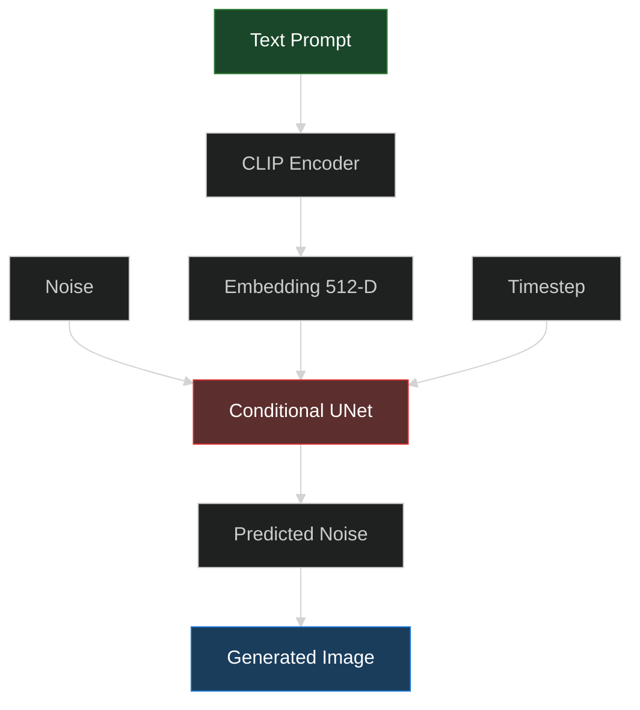
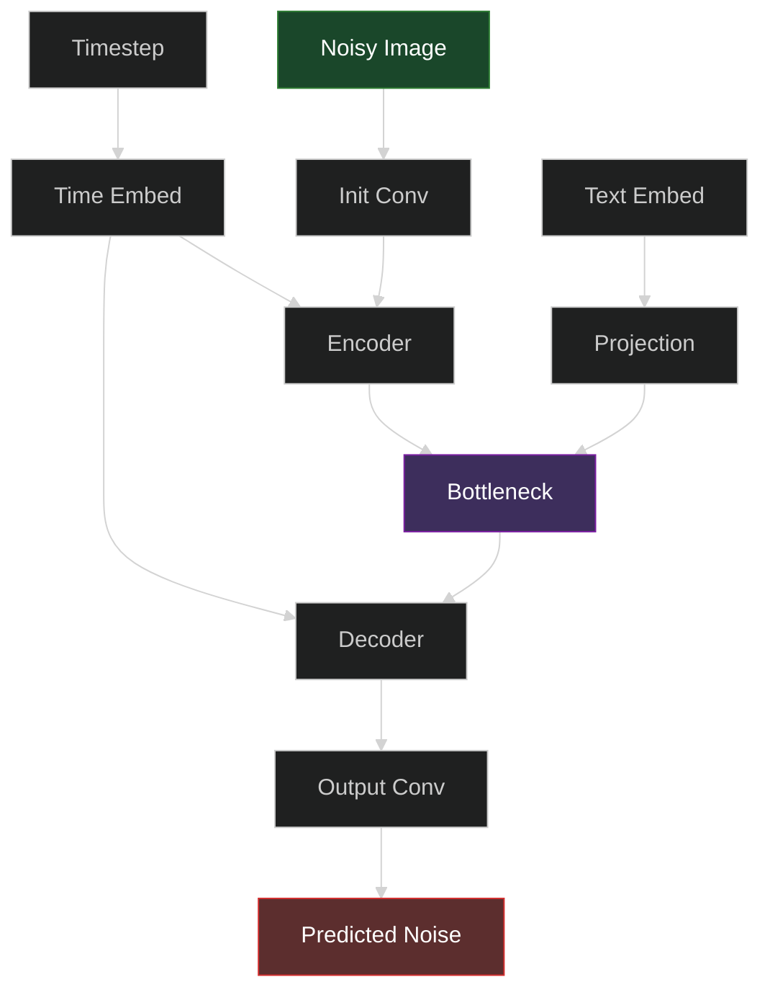
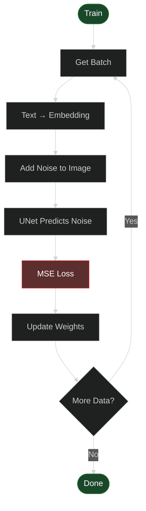

# Text-to-Image Generation Using Conditional Diffusion Models


From-scratch implementation of Text-to-Image Diffusion Model using DDPM + CLIP for conditional image generation.

**Input:** `"a small bird with red feathers and black wings"`  
**Output:** 64×64 RGB image matching the description

---

## How It Works

### Diffusion Process


### Training Objective

$$\mathcal{L} = \mathbb{E}_{x_0, \epsilon, t} \left[ \| \epsilon - \epsilon_\theta(x_t, t, c) \|^2 \right]$$

Neural network predicts the noise $\epsilon$ added at each timestep $t$ conditioned on text $c$.

---

## Architecture



### UNet Details



---

## Project Structure

```
Conditional-Diffusion-Text2Image/
├── data/                # Dataset loading
├── models/              # UNet + Diffusion
├── text_encoder/        # CLIP wrapper
├── utils/               # Helpers & schedulers
├── train.py            # Training script
├── sample.py           # Generation script
└── requirements.txt
```

---

## Dataset

**CUB-200-2011 Birds Dataset** (11,788 images, 200 species)

**HuggingFace:**
```python
from datasets import load_dataset
dataset = load_dataset("alkzar90/CC6204-Hackaton-Cub-Dataset")
```

**Links:**
- [CUB-200 HuggingFace](https://huggingface.co/datasets/alkzar90/CC6204-Hackaton-Cub-Dataset)
- [CUB Train Dataset](https://huggingface.co/datasets/Multimodal-Fatima/CUB_train)
- [Original Dataset](https://www.vision.caltech.edu/datasets/cub_200_2011/)

---

## Installation

```bash
git clone https://github.com/kushalsai-01/Conditional-Diffusion-Text2Image.git
cd Conditional-Diffusion-Text2Image
pip install -r requirements.txt
```

---

## Training

### Quick Start (Synthetic Data)

```bash
python train.py --use_synthetic --epochs 20 --batch_size 8
```

### Full Training (CUB-200)

```bash
python train.py \
    --root_dir ./dataset \
    --epochs 100 \
    --batch_size 16 \
    --timesteps 1000 \
    --lr 1e-4
```

### Training Flow



---

## Generation

### Basic

```bash
python sample.py \
    --checkpoint checkpoints/model_final.pt \
    --prompts "a red bird with black wings"
```

### DDIM (Faster)

```bash
python sample.py \
    --checkpoint checkpoints/model_final.pt \
    --prompts "a blue bird on a branch" \
    --use_ddim \
    --ddim_steps 50
```

---

## Results

### Training Progress


| Epoch | Loss | Sample |
|-------|------|--------|
| 5 | 0.312 |  |
| 10 | 0.187 |  |
| 15 | 0.123 |  |
| 20 | 0.089 |  |

### Generated Samples

**Prompt:** "a small yellow bird with black wings"


---

## Technical Details

| Component | Configuration |
|-----------|--------------|
| Model | Conditional UNet |
| Parameters | ~8M |
| Text Encoder | CLIP ViT-B/32 (frozen) |
| Image Size | 64×64 |
| Timesteps | 1000 (DDPM) / 50 (DDIM) |
| Batch Size | 16 |
| Learning Rate | 1e-4 |
| Scheduler | Cosine with warmup |

---

## References

- [DDPM](https://arxiv.org/abs/2006.11239) - Ho et al., 2020
- [DDIM](https://arxiv.org/abs/2010.02502) - Song et al., 2021
- [CLIP](https://arxiv.org/abs/2103.00020) - Radford et al., 2021

---

## License

MIT License
