# 🎨 Text-to-Image Generation Using Conditional Diffusion Models

<div align="center">


**A complete from-scratch implementation of Text-to-Image Diffusion Model using DDPM + CLIP**

[Getting Started](#-getting-started) •
[How It Works](#-how-diffusion-works) •
[Training](#-training) •
[Generate Images](#-generate-images) •
[Results](#-results)

</div>

---

## 📖 Project Overview

This project implements a **Conditional Denoising Diffusion Probabilistic Model (DDPM)** that generates images from natural language descriptions. Unlike using pre-built APIs like Stable Diffusion or DALL-E, this is a **complete from-scratch implementation** demonstrating deep understanding of generative AI.

### What This Project Does

```
Input:  "a small bird with red feathers and black wings"
           ↓
Output: [Generated 64x64 image of a bird matching the description]
```

---

## 🧠 How Diffusion Works

### The Core Idea

Diffusion models work by learning to **reverse a gradual noising process**:

```mermaid
graph LR
    subgraph Forward Process
        A[Clean Image x₀] -->|Add Noise| B[Slightly Noisy x₁]
        B -->|Add Noise| C[More Noisy x₂]
        C -->|Add Noise| D[...]
        D -->|Add Noise| E[Pure Noise xₜ]
    end
    
    subgraph Reverse Process - What We Learn
        E -->|Remove Noise| D
        D -->|Remove Noise| C
        C -->|Remove Noise| B
        B -->|Remove Noise| A
    end
    
    style A fill:#90EE90
    style E fill:#FFB6C1
```



### Mathematical Foundation

**Forward Diffusion (Adding Noise):**

$$q(x_t | x_0) = \mathcal{N}(x_t; \sqrt{\bar{\alpha}_t} \cdot x_0, (1-\bar{\alpha}_t) \cdot \mathbf{I})$$

**Simplified:** 

$$x_t = \sqrt{\bar{\alpha}_t} \cdot x_0 + \sqrt{1-\bar{\alpha}_t} \cdot \epsilon$$

Where:
- $x_0$ = Original clean image
- $x_t$ = Noisy image at timestep t
- $\epsilon$ = Random Gaussian noise
- $\bar{\alpha}_t$ = Cumulative noise schedule

**Training Objective:**

$$\mathcal{L} = \mathbb{E}_{x_0, \epsilon, t} \left[ \| \epsilon - \epsilon_\theta(x_t, t, c) \|^2 \right]$$

The neural network $\epsilon_\theta$ learns to predict the noise $\epsilon$ that was added.

---

## 🔄 Complete Text-to-Image Pipeline

### High-Level Flow

```mermaid
flowchart TB
    subgraph INPUT
        T[/"Text: 'a red bird with black wings'"/]
    end
    
    subgraph TEXT_ENCODING["📝 Text Encoding"]
        T --> TOK[Tokenization]
        TOK --> CLIP[CLIP Text Encoder]
        CLIP --> EMB[512-D Text Embedding]
    end
    
    subgraph DIFFUSION["🔄 Diffusion Process"]
        N[Random Noise xₜ] --> UNET
        EMB --> UNET[Conditional UNet]
        TIME[Timestep t] --> UNET
        UNET --> PRED[Predicted Noise ε]
        PRED --> DENOISE[Denoise Step]
        DENOISE --> |t > 0| N
        DENOISE --> |t = 0| IMG
    end
    
    subgraph OUTPUT
        IMG[/"Generated Image 64×64"/]
    end
    
    style T fill:#E8F5E9
    style IMG fill:#E3F2FD
    style CLIP fill:#FFF3E0
    style UNET fill:#FCE4EC
```



### Detailed Step-by-Step Process

```mermaid
sequenceDiagram
    participant User
    participant TextEncoder as CLIP Text Encoder
    participant Scheduler as Noise Scheduler
    participant UNet as Conditional UNet
    participant Output as Generated Image
    
    User->>TextEncoder: "a blue bird on a branch"
    TextEncoder->>TextEncoder: Tokenize (77 tokens max)
    TextEncoder->>TextEncoder: Transform through 12 layers
    TextEncoder-->>UNet: text_embedding [1, 512]
    
    Note over Scheduler: Initialize with pure noise
    Scheduler->>UNet: x_T ~ N(0, I) [1, 3, 64, 64]
    
    loop For t = T, T-1, ..., 1, 0
        Scheduler->>UNet: Current noisy image x_t
        Scheduler->>UNet: Timestep t
        UNet->>UNet: Predict noise ε_θ(x_t, t, text_emb)
        UNet-->>Scheduler: Predicted noise
        Scheduler->>Scheduler: Compute x_{t-1} using DDPM formula
    end
    
    Scheduler-->>Output: Clean image x_0
    Output-->>User: 64×64 RGB Image
```



---

## 🏗️ Architecture Deep Dive

### Overall System Architecture


### UNet Architecture Details


---

## 📂 Project Structure

```
Conditional-Diffusion-Text2Image/
│
├── 📁 data/
│   ├── __init__.py
│   └── dataset_loader.py       # Handles image-caption pair loading
│
├── 📁 models/
│   ├── __init__.py
│   ├── unet.py                 # Conditional UNet architecture
│   └── diffusion.py            # DDPM forward/reverse process
│
├── 📁 text_encoder/
│   ├── __init__.py
│   └── text_encoder.py         # CLIP text encoder wrapper
│
├── 📁 utils/
│   ├── __init__.py
│   ├── scheduler.py            # Learning rate schedulers
│   └── helpers.py              # Utilities (EMA, checkpoints, etc.)
│
├── 🐍 train.py                 # Training script
├── 🐍 sample.py                # Image generation script
├── 📋 requirements.txt         # Dependencies
└── 📖 README.md                # This file
```

---

## 🗃️ Dataset

### Recommended: CUB-200-2011 Birds Dataset

This project is designed for the **CUB-200-2011** dataset with text descriptions.

| Dataset | Images | Classes | Image Size |
|---------|--------|---------|------------|
| CUB-200-2011 | 11,788 | 200 bird species | Variable → 64×64 |

### 🤗 HuggingFace Dataset (Recommended)

```python
from datasets import load_dataset

dataset = load_dataset("alkzar90/CC6204-Hackaton-Cub-Dataset")
```

**Direct Links:**
- 🔗 [CUB-200 on HuggingFace](https://huggingface.co/datasets/alkzar90/CC6204-Hackaton-Cub-Dataset)
- 🔗 [CUB Train Dataset](https://huggingface.co/datasets/Multimodal-Fatima/CUB_train)
- 🔗 [Original CUB-200](https://www.vision.caltech.edu/datasets/cub_200_2011/)

### Dataset Structure

```
dataset/
├── images/
│   ├── 001.Black_footed_Albatross/
│   │   ├── Black_Footed_Albatross_0001.jpg
│   │   └── ...
│   └── 200.Common_Yellowthroat/
│       └── ...
└── text/
    ├── 001.Black_footed_Albatross/
    │   ├── Black_Footed_Albatross_0001.txt
    │   └── ...
    └── 200.Common_Yellowthroat/
        └── ...
```

---

## 🚀 Getting Started

### Prerequisites

- Python 3.8+
- CUDA 11.0+ (optional, for GPU)
- 8GB+ RAM
- ~4GB disk space

### Installation

```bash
git clone https://github.com/yourusername/Text2Image-Diffusion.git
cd Text2Image-Diffusion

python -m venv venv
source venv/bin/activate  # Linux/Mac
venv\Scripts\activate     # Windows

pip install -r requirements.txt
```

### Verify Installation

```bash
python -c "import torch; print(f'PyTorch: {torch.__version__}')"
python -c "from transformers import CLIPTokenizer; print('CLIP: OK')"
```

---

## 🏋️ Training

### Quick Start (Synthetic Data)

```bash
python train.py \
    --use_synthetic \
    --synthetic_size 1000 \
    --epochs 10 \
    --batch_size 8 \
    --base_channels 32 \
    --channel_mults 1,2,4 \
    --timesteps 500 \
    --use_simple_encoder
```

### Full Training (CUB-200 Dataset)

```bash
python train.py \
    --data_dir ./dataset \
    --epochs 100 \
    --batch_size 16 \
    --image_size 64 \
    --base_channels 64 \
    --channel_mults 1,2,4,8 \
    --timesteps 1000 \
    --lr 1e-4 \
    --warmup_steps 1000 \
    --save_every 5000 \
    --sample_every 1000
```

### Training Flow


### Training Arguments

| Argument | Default | Description |
|----------|---------|-------------|
| `--data_dir` | `./dataset` | Dataset path |
| `--epochs` | `100` | Training epochs |
| `--batch_size` | `16` | Batch size |
| `--image_size` | `64` | Image resolution |
| `--timesteps` | `1000` | Diffusion steps |
| `--lr` | `1e-4` | Learning rate |
| `--base_channels` | `64` | UNet base channels |
| `--channel_mults` | `1,2,4,8` | Channel multipliers |
| `--use_synthetic` | `False` | Use synthetic data |
| `--mixed_precision` | `False` | FP16 training |

### Expected Training Time

| Hardware | Dataset Size | Epochs | Time |
|----------|--------------|--------|------|
| NVIDIA RTX 3090 | 10K images | 100 | ~6 hours |
| NVIDIA RTX 3060 | 10K images | 100 | ~12 hours |
| CPU (M1 Mac) | 1K synthetic | 10 | ~2 hours |

---

## 🎨 Generate Images

### Basic Generation

```bash
python sample.py \
    --checkpoint checkpoints/model_final.pt \
    --prompt "a beautiful red bird with black wings" \
    --num_samples 4
```

### Advanced Generation with DDIM (Faster)

```bash
python sample.py \
    --checkpoint checkpoints/model_final.pt \
    --prompt "a blue bird sitting on a branch" \
    --num_samples 8 \
    --use_ddim \
    --ddim_steps 50 \
    --save_grid \
    --output_dir ./my_generations
```

### Generation Flow


### DDPM vs DDIM Sampling

| Method | Steps | Time | Quality |
|--------|-------|------|---------|
| DDPM | 1000 | ~60s | Best |
| DDIM | 50 | ~3s | Good |
| DDIM | 100 | ~6s | Better |

---

## 📊 Results

### Training Progress

| Epoch | Loss | Sample Quality |
|-------|------|----------------|
| 1-10 | ~0.5 | Blurry shapes |
| 10-30 | ~0.2 | Basic forms |
| 30-60 | ~0.1 | Recognizable |
| 60-100 | ~0.05 | Clear images |

---

## 🔬 Technical Details

### Key Components

| Component | Purpose | File |
|-----------|---------|------|
| **DDPM** | Noise schedule and diffusion | `models/diffusion.py` |
| **UNet** | Noise prediction network | `models/unet.py` |
| **CLIP** | Text understanding | `text_encoder/text_encoder.py` |
| **Time Embedding** | Encode timestep | Sinusoidal + MLP |
| **EMA** | Stable sampling | `utils/helpers.py` |

### Hyperparameters

```python
{
    "timesteps": 1000,
    "beta_schedule": "linear",
    "beta_start": 1e-4,
    "beta_end": 0.02,
    "image_size": 64,
    "base_channels": 64,
    "channel_multipliers": [1, 2, 4, 8],
    "num_res_blocks": 2,
    "learning_rate": 1e-4,
    "ema_decay": 0.9999
}
```

---

## ⚠️ Limitations

1. **Resolution**: Limited to 64×64 images
2. **Text Understanding**: Simple injection (no cross-attention)
3. **Training Data**: Quality depends on dataset
4. **Compute**: GPU recommended for reasonable training time
5. **Diversity**: May have mode collapse on small datasets

---

## 🚀 Future Improvements

- [ ] Cross-attention for better text conditioning
- [ ] Higher resolution (128×128, 256×256)
- [ ] Classifier-Free Guidance (CFG)
- [ ] Latent Diffusion (VAE)
- [ ] Web UI with Gradio
- [ ] Multi-GPU training

---

## 📚 References

1. **DDPM**: [Denoising Diffusion Probabilistic Models](https://arxiv.org/abs/2006.11239) - Ho et al., 2020
2. **DDIM**: [Denoising Diffusion Implicit Models](https://arxiv.org/abs/2010.02502) - Song et al., 2021
3. **CLIP**: [Learning Transferable Visual Models](https://arxiv.org/abs/2103.00020) - Radford et al., 2021
4. **Improved DDPM**: [Improved Denoising Diffusion](https://arxiv.org/abs/2102.09672) - Nichol and Dhariwal, 2021

---

## 📄 License

MIT License - see [LICENSE](LICENSE) for details.

---

<div align="center">

**⭐ Star this repo if you find it helpful!**

Made with ❤️ for learning and research

</div>
